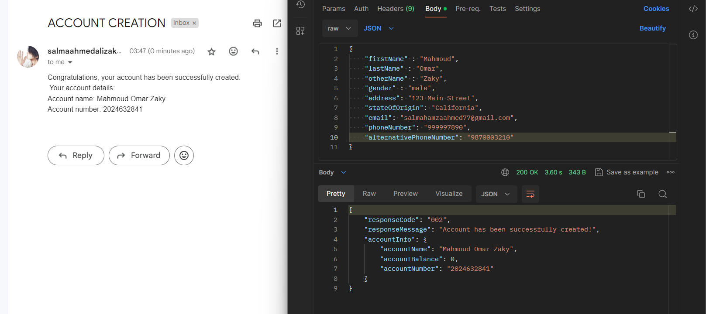
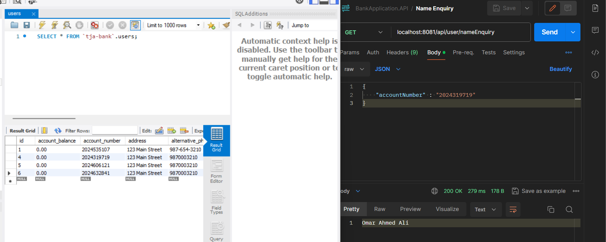

## User Account Creation
- Allows users to create a new account with the specified details.
- Checks for existing accounts to avoid duplication.
- Returns a response with account information upon successful creation.

## Sending Email Alerts

# Account Enquiries

## Name Enquiry

The banking app now supports name enquiry, allowing users to retrieve account holder names by providing the accountNumber. This feature is useful for quick verification and reference.

## Balance Enquiry

Additionally, users can inquire about the account balance using the accountNumber. The balance enquiry feature provides users with instant access to their account's financial status, promoting transparency and ease of use.