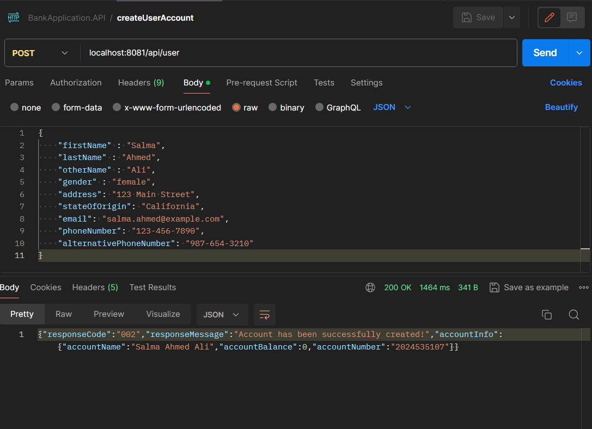

## User Account Creation
- Allows users to create a new account with the specified details.
- Checks for existing accounts to avoid duplication.
- Returns a response with account information upon successful creation.



## Sending Email Alerts


# Account Enquiries

## Name Enquiry


The banking app now supports name enquiry, allowing users to retrieve account holder names by providing the accountNumber. This feature is useful for quick verification and reference.

## Balance Enquiry


Additionally, users can inquire about the account balance using the accountNumber. The balance enquiry feature provides users with instant access to their account's financial status, promoting transparency and ease of use.

## Credit Account

### Success Scenario

When successfully crediting an account, the user's account balance is updated.


### Failure Scenario

If the account number provided for crediting does not exist, an appropriate error response is returned, and the account balance remains unchanged.


## Debit Account

### Success Scenario

When successfully debiting an account, the user's account balance is updated, and an email notification is sent to the user.


### Failure Scenario - Insufficient Balance

If the account does not have sufficient balance for the requested debit amount, an appropriate error response is returned, and the account balance remains unchanged.


## Transfer Service

### Success Scenario

The transfer service allows for a seamless transfer of funds by simultaneously crediting the destination account and debiting the source account. Two email notifications are sent, one to notify the debit account holder and another to notify the credit account holder.

#### MySQL Update

After a successful transfer, the MySQL database is updated with the new balances for both accounts.


#### Email Alerts

Both the debit and credit account holders receive email notifications confirming the successful transfer.


## API Documentation

Explore and test the User Account Management APIs using Swagger documentation. The APIs provide functionalities such as creating a new user account, checking account balance, performing credit and debit transactions, and transferring funds.

### Access Swagger UI

To access the Swagger UI for API documentation, navigate to the following URL:

```plaintext
http://http://localhost:8081//swagger-ui.html#/
```

## Transaction Logging

All transactions are now systematically logged using the Transaction Entity. This includes credit, debit, and transfer transactions. Explore the `Transaction` entity to review the details of each transaction.

### Transaction Entity Details

The `Transaction` entity captures essential information about each transaction, such as transaction type, amount, and the associated user accounts. This enhanced logging ensures a comprehensive record of all financial activities within the system.


